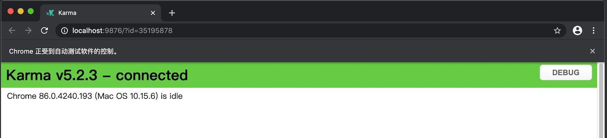
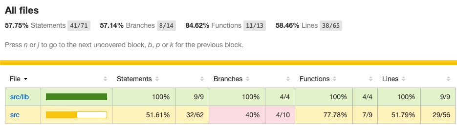
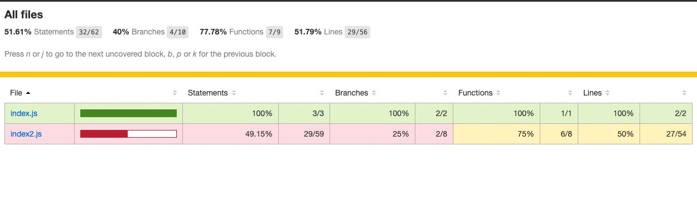

# KJI-AutoUnitTest 🚀

&nbsp;

&nbsp;
&nbsp;

[](https://www.npmjs.com/package/karma-jasmine)
[](https://www.npmjs.com/package/karma-jasmine)
[](https://github.com/karma-runner/karma-jasmine)

[](https://travis-ci.org/karma-runner/karma-jasmine)
[](https://david-dm.org/karma-runner/karma-jasmine)
[](https://david-dm.org/karma-runner/karma-jasmine?type=dev)

> Thank for the [Jasmine](https://jasmine.github.io/) testing framework.

## 🌈 Introduction

Based on [Karma](https://github.com/karma-runner/karma) + [Jasmine](https://github.com/jasmine/jasmine) + [Istanbul](https://github.com/gotwarlost/istanbul)+ [Node.js](https://github.com/nodejs/node) Implementation of automated unit testing framework.

## 🌈 Table of Contents

- [KJI-AutoUnitTest 🚀](#kji-autounittest-)
  - [🌈 Introduction](#-introduction)
  - [🌈 Table of Contents](#-table-of-contents)
    - [Karma](#karma)
    - [Jasmine](#jasmine)
    - [Istanbul](#istanbul)
    - [Node.js](#nodejs)
  - [🌈 Usage](#-usage)
    - [1.Installation](#1installation)
    - [2.Execute Karma Unittest](#2execute-karma-unittest)
    - [3.Check Istanbul Code-Coverage](#3check-istanbul-code-coverage)
  - [🌈 Plugins](#-plugins)
  - [🌈 Some examples of results](#-some-examples-of-results)

### Karma

A simple tool that allows you to execute JavaScript code in multiple real browsers.
The main purpose of [Karma](https://github.com/karma-runner/karma) is to make your test-driven development easy, fast, and fun.

### Jasmine

A [Karma](https://github.com/karma-runner/karma) plugin - adapter for [Jasmine](https://github.com/jasmine/jasmine) testing framework. Simple JavaScript testing framework for browsers and node.js

### Istanbul

[Istanbul](https://github.com/gotwarlost/istanbul) is a JS code coverage tool that computes statement, line, function and branch coverage with module loader hooks to transparently add coverage when running tests. Supports all JS coverage use cases including unit tests, server side functional tests and browser tests. Built for scale.

### Node.js

[Node.js](https://github.com/nodejs/node) is an open-source, cross-platform, JavaScript runtime environment. It executes JavaScript code outside of a browser. For more information on using [Node.js](https://github.com/nodejs/node), see the [Node.js Website](https://nodejs.org/).

## 🌈 Usage

### 1.Installation

```bash
npm install
```

### 2.Execute Karma Unittest

```bash
karma start karma.conf.js
```

A chrome web with url will be automatically appears.

If it doesn't show up as expected, please try it <http://localhost:9876/>



### 3.Check Istanbul Code-Coverage

```bash
open build/reports/coverage/report-html/index.html
```

Here is picture of result, include statement coverage, branches coverage, functions coverage and lines coverage:





For more information about project see the [homepage](https://github.com/YX-XiaoBai/KJI-AutoUnitTest)

## 🌈 Plugins

Here are some plugins for the project:

```json
"devDependencies": {
    "istanbul": "^0.4.5",
    "jasmine": "^3.6.3",
    "karma": "^5.2.3",
    "karma-chrome-launcher": "^3.1.0",
    "karma-coverage": "^2.0.3",
    "karma-jasmine": "^4.0.1"
}
```

## 🌈 Some examples of results

Coverage Report:

-----------------------
| File          | % Stmts | % Branch | % Funcs | % Lines | Uncovered Line #s     |
| ------------- | ------- | -------- | ------- | ------- | --------------------- |
| All files     | 57.75   | 57.14    | 84.62   | 58.46   |
| src           | 51.61   | 40       | 77.78   | 51.79   |
| index.js      | 100     | 100      | 100     | 100     |
| index2.js     | 49.15   | 25       | 75      | 50      | 3-6,26-38,55-62,67-73 |
| src/lib       | 100     | 100      | 100     | 100     |
| calculator.js | 100     | 100      | 100     | 100     |
